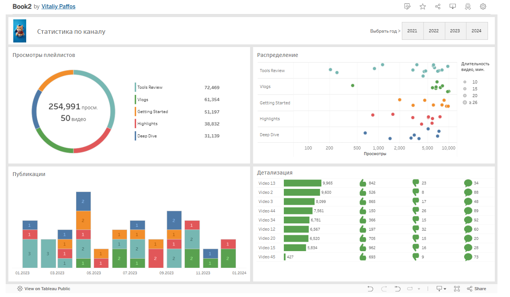

# 🎬 Video Analytics Dashboard (Tableau)

📊 **Интерактивный дашборд**, созданный для визуализации ключевых метрик видеоконтента: просмотры, вовлеченность, распределение по категориям и годам.

---

## 🔍 Описание

Проект анализирует 50 видеороликов, разделенных на тематические плейлисты (категории).  
Для каждого видео отображаются:

- Общее количество просмотров
- Количество лайков, дизлайков и комментариев
- Длительность видео
- Распределение по категориям и месяцам

---

## ⚙️ Используемые технологии

- 📈 Tableau Public (интерактивный дашборд)
- 🧼 Предобработка данных (Excel / Google Sheets)

---

## 🚀 Особенности дашборда

- 📅 Фильтрация по годам (2021–2024)
- 📂 Фильтрация по категориям видео (плейлисты)
- 📊 Графики: круговая диаграмма, scatter plot, bar chart, таблица
- 🧠 Action-фильтры между всеми блоками
- 🖱 Полностью интерактивный пользовательский опыт

---

## 🔗 Ссылка на дашборд в Tableau Public

👉 [Открыть в Tableau Public](https://public.tableau.com/app/profile/vitaliy.paffos/viz/Book2_17525723935420/Dashboard1)

---